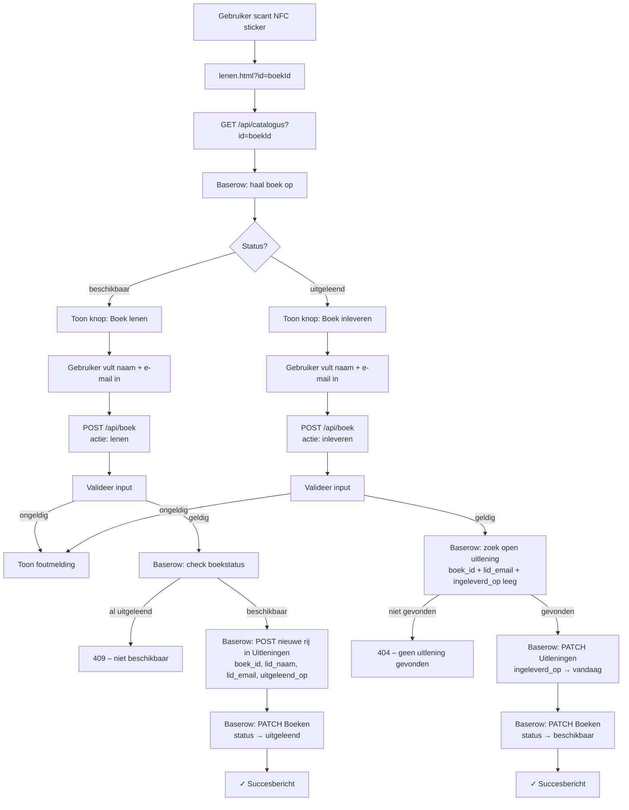
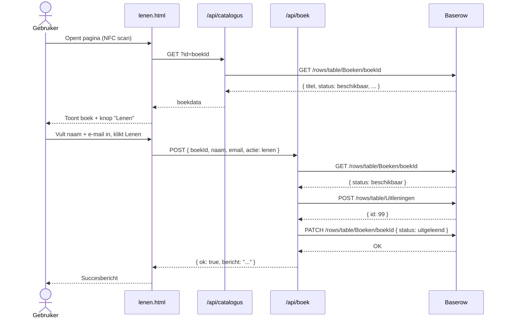
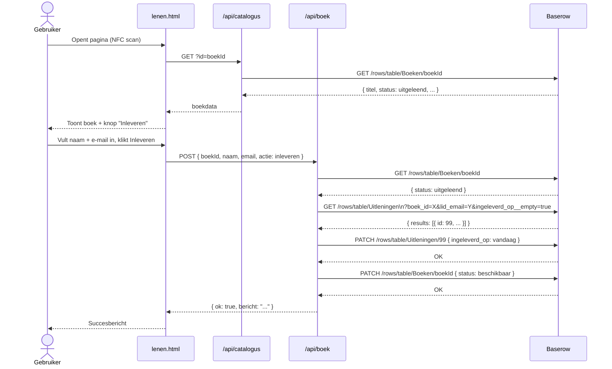

# IVN Bibliotheek — Architectuur

## Flowchart

---

## Sequence diagram — Lenen

---

## Sequence diagram — Inleveren

---

## Componenten

| Component | Locatie | Verantwoordelijkheid |
|-----------|---------|----------------------|
| `index.html` | GitHub Pages | Catalogusoverzicht tonen |
| `lenen.html` | GitHub Pages | Lenen en inleveren formulier |
| `/api/catalogus` | Vercel serverless | Boeken ophalen (readonly) |
| `/api/boek` | Vercel serverless | Lenen en inleveren verwerken |
| Baserow | Cloud | Database: Boeken + Uitleningen |

## Tokens

| Token | Gebruikt door | Rechten |
|-------|--------------|---------|
| `BASEROW_TOKEN_READONLY` | `/api/catalogus` | Alleen lezen op Boeken |
| `BASEROW_TOKEN` | `/api/boek` | Lezen + schrijven op Boeken + Uitleningen |
